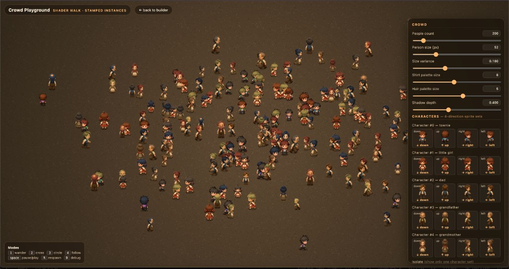

# Crowds System — JS Playground

A zero-dependency, single-file playground that simulates **hundreds to thousands
of pedestrians** on an HTML `<canvas>` with a procedural walk cycle (no
spritesheets, no skeletons, no shaders).



The trick: every person is a **pre-tinted, sliced quad** drawn with simple 2D
context calls — the slices wobble, sway, lean and squash per-frame so a single
4-direction sprite reads as a full walk animation. The same approach ports 1:1
to a WebGL instanced quad with vertex-shader deformation if you want to push
the count even higher.

## Run it

It is plain HTML + CSS + JS — **no build step**. The browser does need to fetch
the PNG sprites from disk, so serve the folder over a static file server:

```bash
# from the repo root
python3 -m http.server 8000
# then open http://localhost:8000
```

…or if you have Node:

```bash
npx serve .
```

## Controls

| Key       | Action                          |
| --------- | ------------------------------- |
| `1`       | Wander mode (random targets)    |
| `2`       | Crossroads (edge to edge)       |
| `3`       | Circle (orbit center)           |
| `4`       | Follow cursor (mob)             |
| `space`   | Pause / play                    |
| `R`       | Respawn                         |
| `D`       | Toggle debug rings              |

The right-side panel exposes every tweakable parameter live: count, size,
shirt/hair palettes, slice count, bob amplitude, body sway, head counter-sway,
leg swing, foot-plant squash, lean, hip line, cadence, cadence variance,
forward speed, turn rate, mode and ground theme.

## How it works

For each person we keep:

- a 4-direction **base sprite** (`down`, `up`, `left`, `right`) — just static
  PNGs, one frame per direction
- a **shirt hue** picked from a small palette (the playground caches the
  per-hue tinted canvases so the GPU/2D context only ever sees `N × M`
  textures for `N` characters and `M` shirt colors)
- a **gait phase** that drives bob / sway / leg-swing / squash / lean each
  frame

The renderer slices each base sprite into `slices` horizontal rows and shifts
them with a sine of the gait phase. Below the **hip line** the rows act as
legs (swing forward/back); above it they act as torso + head (sway, lean and
counter-sway). At foot-plant moments the legs squash vertically. The result is
a convincing walk animation from a single static image per direction.

Because the per-frame work is just slice copies on cached canvases, you can
run **2000+ pedestrians at 60 fps** in a regular browser tab.

## Files

```
index.html                              # the entire playground (HTML + inline JS)
charachters/                            # the four hand-drawn characters
  little-girl/{up,down,left,right}.png
  man-dad/{up,down,left,right}.png
  man-grandfather/{up,down,left,right}.png
  woman-grandmother/{up,down,left,right}.png
sprites_sp1/characters/
  characters_04.png                     # generic "hero" sprite, back facing
  characters_08.png                     #          "         "    front facing
  characters_13.png                     #          "         "    left  facing
  characters_22.png                     #          "         "    right facing
```

> Yes, the folder is misspelled `charachters/` — that's intentional, it
> matches what the game project uses internally and is hard-coded into the
> playground's sprite map. Don't fix it without also updating `index.html`.

## Adding more characters

Drop a folder under `charachters/` containing four PNGs named
`<name>-up.png`, `<name>-down.png`, `<name>-left.png`, `<name>-right.png`.
Then in `index.html`, find the `CHARACTERS` array (around line 690) and add an
entry:

```js
{
  name: "your-character",
  down:  "charachters/your-character/your-character-down.png",
  up:    "charachters/your-character/your-character-up.png",
  right: "charachters/your-character/your-character-right.png",
  left:  "charachters/your-character/your-character-left.png",
},
```

The sprite-grid checkbox UI on the right panel will pick it up automatically
on next load.

## License

MIT — see [`LICENSE`](LICENSE).

## Author

Made by **Ibrahim Boona**.

- X / Twitter: [@boona11](https://x.com/boona11)
- Instagram: [@boona11](https://instagram.com/boona11)
- GitHub: [@boona13](https://github.com/boona13)
